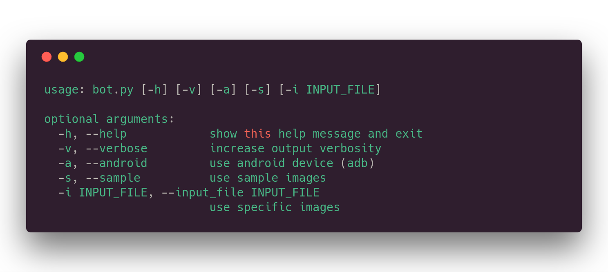
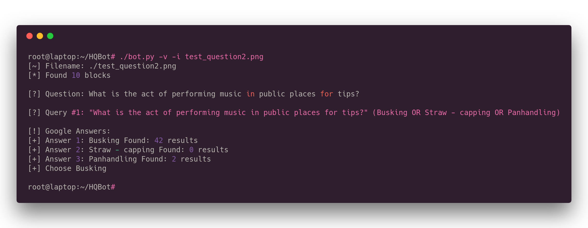

# HQBot [](https://www.python.org/downloads/release/python-2714/) [](http://makeapullrequest.com) [](https://twitter.com/thehappydinoa)


A bot for the popular mobile game HQ Trivia

## Usage



## Example

```bash
./bot.py -v -i test_question2.png
```




`Busking (Verb) - the act of performing in public places for gratuities. In many countries the rewards are generally in the form of money.`

## Installation

1.  Install requirements

```bash
pip install -r requirements.txt
```

2.  Enable API's in Google Cloud. Go to [Google Cloud](https://console.cloud.google.com/home/dashboard).
    Enable [Google Cloud Natural Language API](https://console.cloud.google.com/apis/library/language.googleapis.com), [Google Cloud Custom Search API](https://console.cloud.google.com/apis/api/customsearch.googleapis.com) and [Google Cloud Vision API](https://console.cloud.google.com/apis/library/vision.googleapis.com).

3.  Go to [Google Cloud Credentials Page](https://cloud.google.com/storage/docs/authentication#service_accounts) and download the JSON file.

4.  Set `GOOGLE_APPLICATION_CREDENTIALS` in the config file to the path of where you saved the JSON file.

5.  Create a new (Custom Search Engine)[https://cse.google.com/cse/all]. Enter `www.anyurl.com` in the sites to search input. Click `Create`. Then click `Modify your search engine`, then go down to `Sites to search` and under advanced change from `Search only included sites` to `Search the entire web but emphasize included sites`.

6.  Set `customsearch_id` in the config file to your search engine ID found under the detials section of CSE.

7.  Set `developerKey` in the config file to your Developer API Key found in the [Credentials Page](https://console.developers.google.com/apis/credentials)

8.  Try it:

```bash
./bot.py -v -i test_question2.png
```

## Dependencies

HQBot depends on the following Python 2.7 modules:

    google-cloud-vision
    google-cloud-language
    google-api-python-client


## Note

This is using a Google Custom Search to try and predict the best possible answer. Answers may not be 100% correct but know my HQBot tried its best.

## LICENSE

[MIT License](LICENSE)
